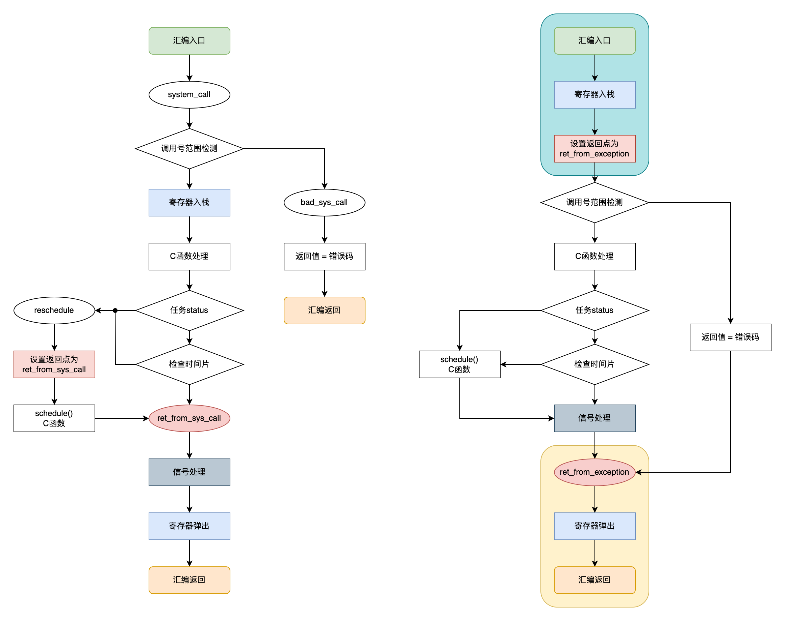

# Log 0 项目的准备

以Linux 0.01的原文件结构建好文件夹, build文件夹不再使用。根据上一个项目的经验保留了tools并加入了debug文件夹。

为每一子文件夹创建对应的Makefile, 修改原Linux 0.01中过时的编译FLAG, 并加入RISC-V特有的FLAG。

引入`.lds.S`类型文件, 方便在编译脚本中使用宏, 加强编译脚本的灵活性。


# Log 1 内核的汇编级启动

内核的汇编级启动涉及到文件head.S。

head.S流程中暂时简化了RISC-V Linux的启动流程。不考虑XIP; 仅支持`Ordered booting`; 仅支持单核, 仅支持sv39。且仅接受以非内置设备树的形式接受外设信息(虽然大概率不会去解析就是了)。

主要流程为: 启动, 关一系列中断, 清除BSS, 转跳到正确的运行地址, 进入C语言主程序。

涉及以下子问题的设计:

1. `trampoline_pg_dir` 如何设计? 
2. 要提前进一次C语言设置好页表吗?
3. pt_regs结构体如何设计? 和Linux一样就好
4. 进程描述符的大小如何? 8KiB


## 1 临时页表使用:

像xv6-k210一样, 临时页表仅使用一张sv39页表并使用大页能映射1GiB的空间, 对内核来说绰绰有余。仅需要设置少数表项也意味着可以用汇编来应付不同内存起点的问题。且这份页表会常驻内存作为未来多核启动的转跳用页表, 仅用一页不会心疼。唯一的问题可能就是由SBI占用了恼人的2MiB (rv32则是4MiB)。

但考虑到后期的可扩展性, 如果采取sv48或sv57的分页模式, 仅使用一张页表会导致颗粒度过大。毕竟sv48单个页表项会导致512GiB对齐, 而sv57会导致256TiB的对齐。到时候总是要回到1GiB对齐的这个区间上来的。在这种情况下再多使用一张页表将颗粒度降到PMD的级别似乎也并无区别。且`trampoline_pg_dir` 作为静态分配的页表的数量也将会是恒定的, 以PMD作为页表意味着在rv64下至少能保证1GiB的空间被覆盖。这对内核来说足够了。


## 2 setup_vm()的C函数必要性

如果采取曾经考虑过的单张页表的方案, 没有必要C函数。

打算以PMD为颗粒度, 便意味着要设置更多的页表项。此时使用C语言来处理是一个好选择, 同时也保证了不同内存起点与大小的灵活性。未来也可以直接在这个函数中添加dtb的解析。但不是在Linux 0.01的移植中, 因为Linux 0.01自身是手动设置的内存, 这个地方可以复古点。


# Log 2 进入路径和退出路径 + 异常/中断处理

进入路径和退出路径可以直接copy RISC-V Linux。


page.s, system_call.s, rs_io.s, keyboard.s, asm.s 都被归入entry.S中。


Linux RISC-V为每个异常都设置了对应的处理, 这是没有必要的
$$
\text{Exceptions}\begin{cases}
  
  \text{Processor detected}\begin{cases}
  
  	\text{Illegal instruction}\\
  
    \text{address misaligned}\begin{cases}
    \text{Instruction address misaligned : 0}\\
    \text{Load address misaligned				 : 4}\\
    \text{Store/AMO address misaligned	 : 6}\\
    \end{cases}\\
    
    \\
    
    \text{access fault}\begin{cases}
    \text{Instruction access fault 	: 1}\\
    \text{Load access fault 				: 5}\\
    \text{Store/AMO access fault 		: 7}\\
    \end{cases}\\
    
    \\
    \text{page fault}\begin{cases}
    \text{Instruction page fault 	: 12}\\
    \text{Load page fault 				: 13}\\
    \text{Store/AMO page fault 		: 15}\\
    \end{cases}\\
  
  \end{cases}\\

  \\

  \text{Programmed}\begin{cases}
  
    \text{ecall}\begin{cases}
    \text{Environment call from U-mode : 8}\\
    \text{Environment call from S-mode : 9}\\
    \text{Environment call from M-mode : 11}\\
    \end{cases}\\
    
    \\
    
    \text{ebreak}\begin{cases}
    \text{Breakpoint : 3}\\
    \end{cases}\\
  
  \end{cases}\\
  
  
\end{cases}\\
$$


# Log 3 vsprintf

## vsprintf

1. **`%s`**: 输出字符串。可以与精度和字段宽度一起使用，以控制输出长度和对齐。
2. **`%o`**: 以八进制形式输出无符号整数。
3. **`%x` 和 `%X`**:
   - `%x`: 以十六进制形式输出无符号整数，使用小写字母（例如 `abcdef`）。
   - `%X`: 以十六进制形式输出无符号整数，使用大写字母（例如 `ABCDEF`）。
4. **`%d` 和 `%i`**: 输出有符号十进制整数。
5. **`%u`**: 输出无符号十进制整数。
6. **`%p`**: 输出指针的地址。通常以十六进制形式表示，地址前会加上 `0x` 前缀。
7. **`%n`**: 将到目前为止输出的字符数量存储到提供的整数指针变量中。

此外，这些格式化选项可以与以下标志一起使用，以进一步控制输出格式：

- **`-`**（LEFT）: 左对齐输出。
- **`+`**（PLUS）: 输出符号（正号或负号）。
- **``**（SPACE）: 如果未输出符号，则在输出前添加空格。
- **`#`**（SPECIAL）: 对于八进制增加前缀 `0`，对于十六进制增加前缀 `0x` 或 `0X`。
- **`0`**（ZEROPAD）: 使用 `0` 进行填充，直到达到所需的宽度。

此外，支持使用字段宽度和精度指定符，它们可以是固定的数字或者 `*` 字符，后者表示将从参数列表中动态提取这些值。

格式化输出还包括长度修饰符，如 `h`（短整数）、`l`（长整数）和 `L`（长长整数），这些可以修饰整数格式化输出，以适应不同的数据大小和类型。

### 1. `-`（LEFT）: 左对齐输出

```c
printf("%-10s", "hello");
```

这将输出字符串 `"hello"` 并在其右侧填充空格，使整个输出占用至少10个字符的宽度。结果看起来像 `"hello "`。

### 2. `+`（PLUS）: 输出符号（正号或负号）

```c
printf("%+d", 42);
printf("%+d", -42);
```

这将分别输出 `"+42"` 和 `"-42"`。即使是正数也会显示符号。

### 3. ` `(SPACE): 如果未输出符号，则在输出前添加空格

```c
printf("% d", 42);
printf("% d", -42);
```

这将输出 `" 42"` 和 `"-42"`。正数前面的空格用于保持正负数值的对齐。

### 4. `#`（SPECIAL）: 对于八进制增加前缀 `0`，对于十六进制增加前缀 `0x` 或 `0X`

- 八进制：

  ```c
  printf("%#o", 10);
  ```

  这将输出 `"012"`，在数字前增加了 `0`。

- 十六进制：

  ```c
  printf("%#x", 10);
  printf("%#X", 10);
  ```

  这将输出 `"0xa"` 和 `"0XA"`，在数字前增加了 `0x`。

### 5. `0`（ZEROPAD）: 使用 `0` 进行填充，直到达到所需的宽度

```c
printf("%010d", 42);
```

### 6. `*`限制输出宽度

```c
printf("%*d\n",10,a);
printf("%*.*f\n",0,5,b);
printf("%*.*s",10,3,p);
```

# Log 4 页表接口实现

1. ==页表映射==

   对于超过2级的页表而言, 有一个能自动映射中间级的映射函数是很重要的。

   同时, 这个函数能在为新的中间级分配失败时自动回收已经新分配(但因为更叶子页表分配失败)的页的功能是很必要的。

2. 有能力映射长范围

   这样的功能是不必要的, 至少暂时不必要。

   现在唯一能用到的场景是内核初始化。

   进程有写时复制和page-on-demand, Linux本质上就是在推迟页表的分配, 所以也没必要为进程分配大段空间。

   ==但可以实现为页表的复制, 高地址直接复制, 低地址复制的同时提升引用。==

3. 单页取消映射

   单页取消不一定是需要的, 但是中间页的清除可以推迟。

   对于rv64而言, 中间页至少要2MiB的空间全部清除才可能清除一个中间页。对于我们现在的程序量来说不太多。同时有swap机制的存在, 有可能清除的页只是暂时被换出去而已。

   栈和brk更倾向于是增长的。栈的跨页面回撤更也更容易被用回来。brk的回撤更可能紧接着exit, 除非有人故意做一些内存泄露的事。所以暂时没啥必要

4. 多页取消映射

   ==可以连着清除页, 但没必要作为普通用途==。在暂时的设计里, 除了exit一个进程, 很难大量的取消映射页。但exit进程肯定是要清除中间页的, 这种时候将整个下半root页表清除就OK了, 中间页一起处理。没必要像xv6-riscv那样, 提供一个可以取消映射很多页, 但不清除中间页, 需要额外函数来做的情况, 没什么必要。

5. 映射关系

   对暂时的内核来说, 实现4KiB的颗粒度就够了。

   在没有实现vma之前, 其最主要的用途主要是==写时复制==这种需要修改pte内容的,  所以记得返回一个pte的指针。

   但写给未来的我: 记得用satp mode + level写一个可以返回映射地址和页面大小的函数, 现在就4KiB就行。


# Log 5 syscall路径

椭圆是汇编标号。颜色表示了相似的对应关系。



以此为指导移植C语言函数部分。


## 信号处理

仅支持内核中的处理, 用户态暂时没想到怎样比较好的移植。